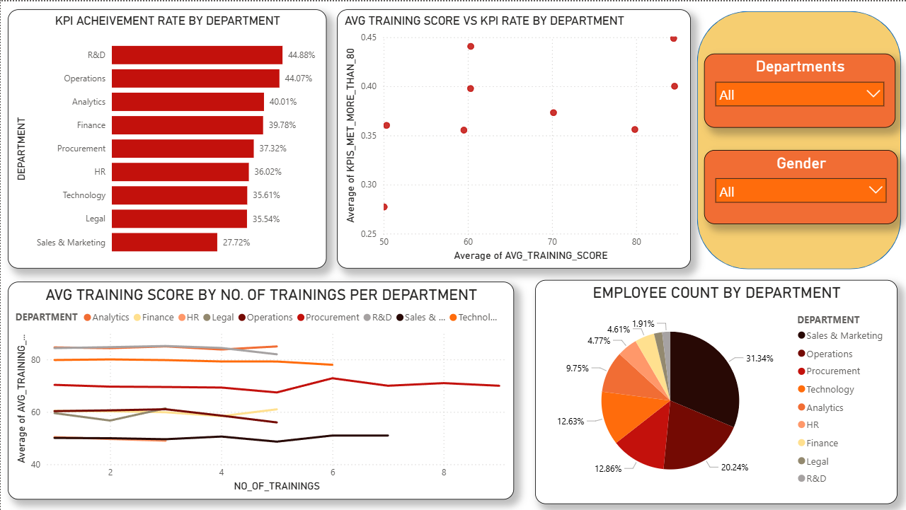
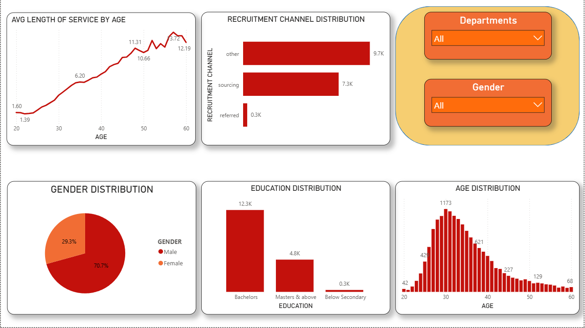

# HR Analytics: Employee Performance Analysis

A comprehensive data analysis project examining 17,000+ employee records to identify key drivers of performance and awards in the workplace.

## 📊 Project Overview

This end-to-end analytics project analyzes HR data to uncover patterns in employee performance, training effectiveness, and departmental differences. The project demonstrates the complete data pipeline from raw data cleaning through interactive dashboard creation.

**Dataset:** [Employee Performance for HR Analytics](https://www.kaggle.com/datasets/sanjanchaudhari/employees-performance-for-hr-analytics) (Kaggle)  
**Records Analyzed:** 17,414 employees  
**Time Period:** 2 days

## 🎯 Key Findings

- **R&D and Operations** departments achieve 44% KPI rates, 63% higher than Sales & Marketing (27%)
- Only **2.3% of employees** win awards, concentrated in Sales & Operations departments
- **Previous year performance** is the strongest predictor of current KPI achievement (5.0-rated employees have 63% KPI rate vs 13% for 1.0-rated)
- **Referred employees** outperform other recruitment channels by 8% in ratings
- Training **quality** matters more than training **quantity** — more sessions don't guarantee better outcomes

## 🛠️ Tools & Technologies

- **Python** — Data cleaning and analysis (Pandas, NumPy, Matplotlib, Seaborn, Plotly)
- **SQL Server** — Database design and querying
- **Power BI** — Interactive dashboard creation
- **Jupyter Notebook** — Documentation and reproducibility

## 📁 Project Structure

```
hr-analytics-project/
│
├── HR_Analytics_Project.ipynb    # Main analysis notebook
├── SQL_Analysis.sql               # Database creation & queries
├── dashboard.pbix                 # Power BI dashboard file
│
├── data/
│   ├── departments.csv            # Dimension table
│   ├── regions.csv                # Dimension table
│   ├── employees.csv              # Dimension table
│   └── fact.csv                   # Fact table
│
├── screenshots/
│   ├── executive_summary.png
│   ├── employee_insights.png
│   ├── regional_analysis.png
│   └── department_performance.png
│
└── README.md
```

## 🔄 Methodology

### 1. Data Collection & Exploration
- Loaded 17,417 raw employee records from Kaggle
- Explored distributions, identified data types, checked for quality issues

### 2. Data Cleaning
- Imputed missing education values using department mode (771 records)
- Imputed missing ratings using mean (1,363 records)
- Fixed gender inconsistencies (m/f → Male/Female)
- Removed 3 duplicate records
- Final clean dataset: 17,414 employees

### 3. Exploratory Data Analysis
- Detected outliers using IQR method
- Analyzed distributions across demographics and departments
- Identified correlations between training, performance, and awards
- Created 10+ visualizations revealing key patterns

### 4. Database Design
- Designed normalized star schema with 1 fact table and 3 dimension tables
- Created SQL Server database with proper primary/foreign keys
- Loaded data using BULK INSERT (17,414 records)
- Wrote 10 analysis queries examining department, gender, and training patterns

### 5. Dashboard Creation
- Built interactive Power BI dashboard with 5 pages
- Implemented metric switcher for dynamic regional analysis
- Created executive summary highlighting key insights
- Applied consistent color scheme and professional formatting

## 📈 Dashboard Pages

1. **Executive Summary** — High-level KPIs and top 3 insights
2. **Overview** — 6 key metrics with department and gender filters
3. **Employee Insights** — Demographics, education, recruitment analysis
4. **Regional Analysis** — Interactive metric switcher for 34 regions
5. **Department Performance** — KPI rates, awards, training effectiveness

## 💡 Technical Highlights

- **Star Schema Design** — Proper normalization with fact and dimension tables
- **Advanced Python** — Lambda functions for grouped imputation, method chaining
- **SQL Analysis** — JOINs, GROUP BY, aggregations, type conversions
- **Power BI Features** — DAX measures, slicers, interactive filtering, custom metrics
- **Data Quality** — Handled missing values, duplicates, inconsistencies, outliers

## 📊 Sample Visualizations

### KPI Achievement by Department
R&D leads with 44.88% achievement rate, while Sales & Marketing trails at 27.72%

### Training Score vs KPI Rate
Scatter plot reveals training quality matters more than quantity — no linear relationship between number of sessions and performance

### Regional Distribution
Interactive switcher allows filtering by employee count, KPI rate, or training score across 34 regions

### Executive Summary


### Department Performance


### Employee Insights


## 🚀 How to Run This Project

### Prerequisites
- Python 3.8+
- SQL Server 2019+
- Power BI Desktop
- Jupyter Notebook

### Python Analysis
```bash
# Install dependencies
pip install pandas numpy matplotlib seaborn plotly

# Run notebook
jupyter notebook HR_Analytics_Project.ipynb
```

### SQL Database
```sql
-- Run in SQL Server Management Studio
-- Execute SQL_Analysis.sql to create database and load data
```

### Power BI Dashboard
1. Open `dashboard.pbix` in Power BI Desktop
2. Update data source connection to your SQL Server
3. Refresh data

## 📝 Future Improvements

- Add time-series analysis if historical data becomes available
- Implement predictive models for employee attrition
- Expand regional analysis with geographic mapping
- Create automated alerting for low-performing departments

## 👤 Author

**Malak Usama**

Connect with me on [LinkedIn](https://www.linkedin.com/in/malak-usama-3835722b2/) | View more projects on [GitHub](https://github.com/malak-00)

## 📄 License

This project uses publicly available data from Kaggle for educational purposes.

---

⭐ If you found this project helpful, please consider giving it a star!
